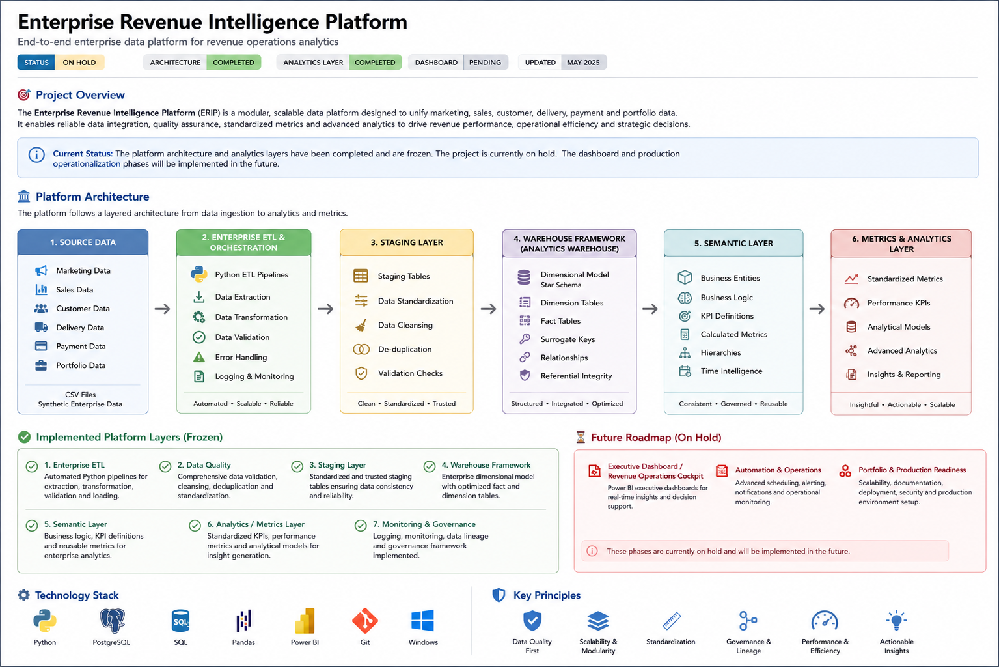

# Enterprise Revenue Intelligence Platform

### Enterprise data platform for revenue, customer, product, seller, and operational analytics

> **Project Status: On Hold**
>
> The Enterprise Revenue Intelligence Platform (ERIP) is a portfolio-scale analytics platform designed to transform raw operational data into governed, reusable analytical datasets, semantic views, standardized metrics, and business insights.
>
> The core platform architecture, ETL foundations, data quality, monitoring, warehouse, semantic, and analytics layers have been implemented. The project is currently on hold before the remaining dashboard, automation, and production-readiness phases.

---

## Overview

Enterprise Revenue Intelligence Platform (ERIP) is an end-to-end analytics platform built to demonstrate how fragmented business data can be transformed into a structured analytical environment.

The platform combines:

* Enterprise ETL and orchestration
* Data validation and quality controls
* Monitoring and observability
* PostgreSQL-based warehouse architecture
* Dimensional modeling
* Semantic views and business entities
* Standardized KPI and metrics development
* Revenue, customer, product, seller, and operational analytics

The project was designed around a layered architecture in which each component has a defined responsibility and dependencies are managed explicitly rather than allowing analytical or presentation logic to bypass the platform.

---

## Business Problem

Organizations often collect large volumes of transactional and operational data across different business processes, but that data is rarely structured for reliable analysis.

Common challenges include:

* Fragmented source data
* Inconsistent business definitions
* Repeated metric calculations
* Limited data validation
* Tight coupling between pipelines and analytical outputs
* Difficulty tracing failures across data workflows
* Inconsistent reporting logic
* Analytics layers that depend directly on raw operational data

ERIP addresses these challenges by introducing a structured path from source data through ingestion, quality controls, warehousing, semantic modeling, and analytical metrics.

---

# Platform Architecture

The platform follows a layered architecture designed to separate ingestion, transformation, storage, semantic definition, and analytics.




### Core analytical flow

```text
Source Data
    │
    ▼
Enterprise ETL & Orchestration
    │
    ▼
Staging Layer
    │
    ▼
Analytics Warehouse
    │
    ▼
Semantic Layer
    │
    ▼
Metrics & Analytics Layer
```

Supporting capabilities such as **data quality, validation, monitoring, observability, configuration, and dependency management** operate across the platform rather than functioning as isolated reporting stages.

---

# Implemented Platform Capabilities

## 1. Enterprise ETL and Orchestration

The ETL layer provides a structured framework for moving source data into the analytical environment.

Core responsibilities include:

* Dataset registration
* Data extraction
* Transformation
* Validation
* Loading
* Execution context management
* Stage registration
* Dependency-aware pipeline execution
* Incremental execution patterns
* Runtime logging

The orchestration architecture separates pipeline coordination from individual extraction, transformation, and loading responsibilities.

---

## 2. Data Quality and Validation

Data quality is treated as a platform capability rather than an afterthought.

The framework supports validation of data as it moves through the pipeline, including controls for:

* Schema expectations
* Required fields
* Duplicate records
* Data consistency
* Transformation validation
* Load validation

This creates a clearer boundary between raw source data and trusted analytical datasets.

---

## 3. Monitoring and Observability

ERIP includes monitoring and observability capabilities to improve visibility into platform execution.

These components support:

* Execution logging
* Runtime state
* Validation outcomes
* Pipeline diagnostics
* Framework health
* Error reporting

The objective is to make pipeline execution more observable and easier to diagnose as the platform grows.

---

## 4. Analytics Warehouse

The warehouse layer provides the structured analytical foundation for the platform.

The implementation includes:

* Staging tables
* Dimension tables
* Fact tables
* Surrogate key management
* Referential integrity
* Analytical loading procedures
* Warehouse execution management

The analytical model is designed to support reusable business analysis rather than direct reporting from raw transactional tables.

A key implemented analytical fact table supports order-level item analysis at a grain of **one row per order item**, providing a consistent foundation for downstream revenue and operational metrics.

---

## 5. Semantic Layer

The semantic layer separates business-facing analytical definitions from the underlying physical warehouse structure.

The implementation includes semantic views representing business domains such as:

* Revenue performance
* Customer performance
* Product performance
* Seller performance
* Delivery performance
* Review performance
* Logistics performance
* Payment performance

The framework is dependency-aware and designed to preserve relationships between semantic assets while supporting reusable business definitions.

This allows downstream analytics to work with consistent business concepts rather than repeatedly rebuilding logic from warehouse tables.

---

## 6. Metrics and Analytics Layer

The analytics layer builds standardized metrics on top of the semantic model.

Implemented analytical domains include:

### Revenue Analytics

* Revenue trends
* Monthly performance
* Revenue contribution
* Commercial performance metrics

### Customer Analytics

* Customer value
* Customer purchasing behavior
* Revenue contribution
* Customer performance indicators

### Product Analytics

* Product performance
* Sales contribution
* Commercial trends

### Seller Analytics

* Seller performance
* Revenue contribution
* Operational performance

### Operations Analytics

* Delivery performance
* Logistics performance
* Review performance
* Payment performance

### Executive Metrics

The platform also includes executive-level metric development intended to consolidate domain-level KPIs into a reusable analytical snapshot.

> The executive dashboard or Revenue Operations Cockpit was **not completed**. The implemented work focuses on the analytical and metric foundations that would support that presentation layer.

---

# Architecture Principles

ERIP was developed around several architectural principles.

### Separation of Responsibilities

Each layer has a defined responsibility.

```text
ETL
    → data movement and transformation

Warehouse
    → structured analytical storage

Semantic Layer
    → reusable business definitions

Metrics Layer
    → standardized analytical calculations

Presentation Layer
    → future dashboard and decision support
```

The intended architecture does not allow downstream layers to bypass upstream responsibilities without explicit justification.

---

### Dependency-Aware Design

The platform uses registries and dependency-aware execution patterns to manage relationships between platform components.

This reduces tight coupling and makes framework initialization and execution more explicit.

---

### Reusable Business Logic

Business definitions are centralized through semantic and metric layers rather than repeatedly embedded in individual reports or queries.

---

### Data Quality by Design

Validation and quality controls are integrated into the data workflow to support more reliable downstream analysis.

---

### Observability

Execution logging and monitoring are treated as platform capabilities that support diagnostics and operational visibility.

---

# Technology Stack

| Area              | Technologies                                                         |
| ----------------- | -------------------------------------------------------------------- |
| Programming       | Python                                                               |
| Database          | PostgreSQL                                                           |
| Querying          | SQL                                                                  |
| Data Processing   | Pandas                                                               |
| ETL               | Custom extraction, transformation, validation, and loading framework |
| Data Modeling     | Dimensional modeling                                                 |
| Semantic Modeling | SQL semantic views and dependency-aware semantic registry            |
| Orchestration     | ETL pipeline and stage orchestration                                 |
| Data Quality      | Validation framework and quality controls                            |
| Monitoring        | Logging, diagnostics, monitoring, and observability components       |
| Version Control   | Git and GitHub                                                       |

---

# Repository Structure

```text
Enterprise-Revenue-Intelligence-Platform/
│
├── config/                 # Platform configuration
├── data/
│   └── raw/                # Source datasets
│
├── docs/
│   ├── architecture/       # Architecture documentation
│   ├── ETL_MIGRATION_GUIDE.md
│   ├── METRICS_DEVELOPMENT_STANDARD.md
│   └── PROJECT_STATUS.md
│
├── scripts/                # Utility and execution scripts
│
├── sql/
│   ├── analytics/          # Analytical queries and views
│   ├── metrics/            # Domain and executive metrics
│   ├── procedures/         # Warehouse procedures
│   └── validation/         # SQL validation scripts
│
├── src/
│   ├── config/             # Configuration framework
│   ├── core/               # Shared platform components
│   ├── database/           # Database integration
│   ├── etl/                # ETL framework
│   ├── monitoring/         # Monitoring framework
│   ├── observability/      # Observability components
│   ├── orchestration/      # Pipeline orchestration
│   ├── presentation/       # Presentation abstractions
│   ├── quality/            # Data quality framework
│   ├── runtime/            # Runtime management
│   ├── semantic/           # Semantic framework
│   └── warehouse/          # Warehouse framework
│
├── validation/             # Validation assets
├── main.py                 # Platform entry point
├── pyproject.toml
└── requirements.txt
```

---

# Implementation Status

| Platform Area                                    | Status        |
| ------------------------------------------------ | ------------- |
| Repository and Configuration Framework           | ✅ Complete    |
| Database Framework                               | ✅ Complete    |
| Warehouse Framework                              | ✅ Complete    |
| Semantic Framework                               | ✅ Complete    |
| Data Quality Framework                           | ✅ Complete    |
| Monitoring Framework                             | ✅ Complete    |
| Platform Core and Runtime Foundations            | ✅ Complete    |
| Enterprise ETL Orchestration                     | ✅ Implemented |
| Analytics and Metrics Layer                      | ✅ Implemented |
| Executive Dashboard / Revenue Operations Cockpit | ⏸ On Hold     |
| Automation and Operations                        | ⏸ Not Started |
| Portfolio and Production Readiness               | ⏸ Not Started |

---

# Data Flow

The implemented analytical workflow follows this progression:

```text
Raw Source Data
      │
      ▼
Extraction
      │
      ▼
Transformation
      │
      ▼
Validation
      │
      ▼
Staging Tables
      │
      ▼
Analytics Warehouse
      │
      ├── Dimension Tables
      └── Fact Tables
              │
              ▼
        Semantic Views
              │
              ▼
        KPI & Metrics Layer
              │
              ▼
       Analytical Insights
```

The presentation layer was planned as the next major stage but has not yet been implemented.

---

# Analytical Data Model

The warehouse follows a dimensional modeling approach designed to support efficient and reusable business analysis.

Core analytical domains include:

* Sales
* Customers
* Products
* Sellers
* Dates
* Payments
* Delivery and logistics
* Customer reviews

The fact and dimension structure provides the foundation for semantic views and standardized analytical metrics.

---

# Documentation

The repository includes supporting documentation for platform development and standards.

Key documents include:

* Architecture documentation
* ETL migration guidance
* Dataset migration checklist
* Metrics development standards
* Project status documentation

These documents support the separation between platform implementation, development standards, and project-level progress.

---

# Future Roadmap

The project is currently on hold. The remaining planned phases are:

## Executive Dashboard / Revenue Operations Cockpit

Build a business-facing presentation layer using the completed semantic and metrics foundations.

Potential areas include:

* Executive performance monitoring
* Revenue and commercial performance
* Customer intelligence
* Operational performance
* KPI monitoring
* Risk and exception visibility

## Automation and Operations

Extend the platform with additional operational capabilities, including:

* Scheduled execution
* Automated monitoring
* Operational alerts
* Failure handling
* Execution reporting

## Portfolio and Production Readiness

Complete the project with:

* Final documentation
* Architecture diagrams
* Data lineage documentation
* Testing and validation coverage
* Deployment guidance
* Portfolio presentation assets

---

# What This Project Demonstrates

ERIP was designed to demonstrate capabilities across the analytics engineering and business intelligence lifecycle:

* Designing a layered data architecture
* Building reusable ETL components
* Implementing dependency-aware orchestration
* Developing data quality controls
* Creating a dimensional warehouse
* Managing analytical database procedures
* Building semantic business definitions
* Standardizing KPI logic
* Developing domain-specific analytics
* Designing for observability and maintainability

The project intentionally focuses on the platform required **before dashboards are built**.

Rather than treating a dashboard as the analytics solution itself, ERIP establishes the data, warehouse, semantic, and metrics foundations required to support reliable reporting and decision-making.

---

# Project Status

**ERIP is currently on hold.**

The completed work represents the platform and analytical foundation of the project. Future development will focus on the presentation, automation, and production-readiness layers.

The project remains publicly available as a portfolio demonstration of enterprise-oriented analytics architecture and implementation.

---

## Key Takeaway

> **Reliable analytics does not begin with a dashboard. It begins with a well-designed path from raw data to trusted business definitions and reusable metrics.**

ERIP was built to demonstrate that path.
